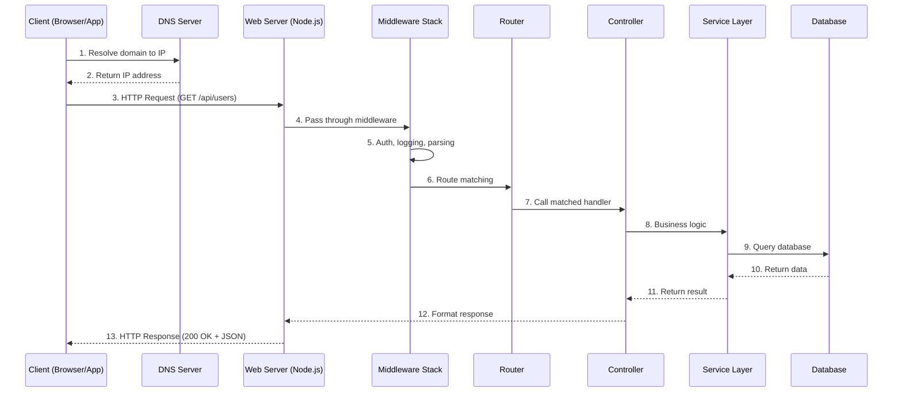

# How the Server Works (Request–Response Cycle)

## 1. Concept & Theory

### Definition

The **Request-Response Cycle** is the fundamental communication pattern between a client (browser, mobile app, or another server) and a server. The client sends an **HTTP Request** asking for something. The server processes it and sends back an **HTTP Response** with the result.

This is how all web communication works. Every time you load a webpage, submit a form, or fetch data from an API, you are completing a request-response cycle.

### The Problem it Solves

Without a standardized request-response model, clients and servers would have no common language. Imagine calling a restaurant where you speak English, but the person answering speaks only Japanese. No order gets placed.

The request-response cycle solves this by defining:
- **How to ask** (HTTP methods like GET, POST)
- **What to ask for** (URLs and paths)
- **How to package the question** (Headers, body)
- **How to package the answer** (Status codes, response body)

If we didn't have this pattern:
- Clients wouldn't know how to format their requests
- Servers wouldn't know how to interpret them
- There would be no way to indicate success or failure
- The internet as we know it wouldn't exist

### Real-World Analogy

Think of a **restaurant**.

1. You (the **client**) sit at a table and look at the menu.
2. You call a waiter and place an **order** (the **request**).
3. The waiter takes your order to the **kitchen** (the **server**).
4. The kitchen prepares your food (server **processes** the request).
5. The waiter brings back your dish (the **response**).

The waiter is like the **HTTP protocol**—a messenger that knows the rules of communication. The order slip is the **request object**. The dish is the **response object**.

If the kitchen is out of an ingredient, the waiter tells you "Sorry, that's unavailable" (a **404** or **500** error). If everything works, you get your food (**200 OK**).

---

## 2. Visual Architecture (Mermaid)



---

## 3. How It Works (Step-by-Step)

Here's what happens when you type `https://api.example.com/users` in your browser:

1. **DNS Resolution**: Your browser doesn't understand domain names. It asks a **DNS server** to translate `api.example.com` into an **IP address** (e.g., `93.184.216.34`). This is like looking up a phone number in a directory.

2. **TCP Connection (Handshake)**: Your browser establishes a **TCP connection** with the server. This involves a three-way handshake:
   - Client: "Hey, can we talk?" (SYN)
   - Server: "Yes, I'm ready." (SYN-ACK)
   - Client: "Great, let's go." (ACK)

   This ensures both sides are ready to communicate reliably.

3. **TLS/SSL Handshake** (for HTTPS): If the connection is secure, your browser and the server exchange **encryption keys**. All data after this is encrypted. This prevents hackers from reading your traffic.

4. **HTTP Request Sent**: The browser constructs an **HTTP request** and sends it over the TCP connection. A request contains:
   - **Method**: GET, POST, PUT, DELETE, etc.
   - **Path**: `/users`
   - **Headers**: Metadata like `Content-Type`, `Authorization`
   - **Body**: (Optional) Data for POST/PUT requests

5. **Server Receives Request**: The **Node.js runtime** receives raw bytes from the network. It uses the `http` module to parse these bytes into a **request object** (`req`).

6. **Middleware Execution**: The request passes through a chain of **middleware functions**. Each middleware can:
   - Read/modify the request
   - Send a response early (e.g., authentication failure)
   - Call `next()` to pass control to the next middleware

7. **Routing**: The **router** matches the request path (`/users`) and method (`GET`) to a specific **handler function**.

8. **Controller Handles Request**: The matched **controller** function receives `req` and `res` objects. It extracts parameters, validates input, and calls the appropriate **service**.

9. **Service Layer (Business Logic)**: The **service** contains the core logic. It might query a database, call external APIs, or perform calculations. This layer is framework-agnostic—it doesn't know about HTTP.

10. **Database Query**: If data is needed, the service queries the **database**. The database returns rows or documents.

11. **Response Construction**: The controller receives data from the service. It constructs a **response object** with:
    - **Status Code**: 200, 404, 500, etc.
    - **Headers**: `Content-Type: application/json`
    - **Body**: JSON data, HTML, or other content

12. **Response Sent**: Node.js serializes the response and sends it back through the TCP connection to the client.

13. **Client Renders**: The browser receives the response. For JSON, JavaScript handles it. For HTML, the browser renders the page.

---

## 4. Code Implementation (MERN Context)

Let's build a simple server that demonstrates the complete request-response cycle.

### Project Structure

```
src/
├── server.js           # Entry point - creates HTTP server
├── app.js              # Express app configuration
├── routes/
│   └── userRoutes.js   # Route definitions
├── controllers/
│   └── userController.js   # Request handlers
├── services/
│   └── userService.js      # Business logic
└── middleware/
    └── logger.js           # Custom middleware
```

### server.js
```javascript
// server.js
// Entry point for the Express application.
// We separate this from app.js for testing purposes.

const app = require('./app');

const PORT = process.env.PORT || 3000;

// Express's listen() method creates an HTTP server internally.
// Under the hood, it calls Node's http.createServer(app) for you.
// This is the standard way to start an Express server.
app.listen(PORT, () => {
    console.log(`Server running on port ${PORT}`);
    console.log(`Process ID: ${process.pid}`);
});

// When a request comes in:
// 1. OS receives TCP packets on port 3000
// 2. OS notifies Node.js via libuv (C library)
// 3. Node.js parses HTTP and creates req/res objects
// 4. Express handles the request through middleware chain
```

### app.js
```javascript
// app.js
// Express application setup with middleware chain.

const express = require('express');
const logger = require('./middleware/logger');
const userRoutes = require('./routes/userRoutes');

const app = express();

// === MIDDLEWARE CHAIN ===
// Each middleware runs in order. Think of it as a pipeline.

// 1. Built-in middleware to parse JSON bodies
// When Content-Type is application/json, this parses the body
// and attaches it to req.body
app.use(express.json());

// 2. Custom logging middleware - logs every request
app.use(logger);

// 3. Route middleware - handles /api/users paths
app.use('/api/users', userRoutes);

// 4. 404 handler - catches all unmatched routes
app.use((req, res) => {
    res.status(404).json({
        success: false,
        message: `Route ${req.method} ${req.path} not found`
    });
});

// 5. Error handler - catches all errors thrown in the app
app.use((err, req, res, next) => {
    console.error('Error:', err.message);
    res.status(err.status || 500).json({
        success: false,
        message: err.message || 'Internal Server Error'
    });
});

module.exports = app;
```

### middleware/logger.js
```javascript
// middleware/logger.js
// A middleware function receives (req, res, next).
// It MUST call next() to pass control to the next middleware,
// or send a response to end the cycle.

const logger = (req, res, next) => {
    const start = Date.now();

    // Log when request comes in
    console.log(`--> ${req.method} ${req.originalUrl}`);

    // res.on('finish') fires when the response has been sent.
    // We use this to log the response time.
    res.on('finish', () => {
        const duration = Date.now() - start;
        console.log(`<-- ${req.method} ${req.originalUrl} ${res.statusCode} (${duration}ms)`);
    });

    // CRITICAL: Call next() to continue the chain.
    // If we don't call next(), the request hangs forever.
    next();
};

module.exports = logger;
```

### routes/userRoutes.js
```javascript
// routes/userRoutes.js
// Routes define WHAT endpoints exist.
// They map HTTP method + path to a controller function.

const express = require('express');
const router = express.Router();
const userController = require('../controllers/userController');

// GET /api/users - Fetch all users
router.get('/', userController.getAllUsers);

// GET /api/users/:id - Fetch single user by ID
router.get('/:id', userController.getUserById);

// POST /api/users - Create new user
router.post('/', userController.createUser);

module.exports = router;
```

### controllers/userController.js
```javascript
// controllers/userController.js
// Controllers handle HTTP concerns: parsing request, sending response.
// They should NOT contain business logic - that goes in services.

const userService = require('../services/userService');

const userController = {
    // Handler for GET /api/users
    getAllUsers: async (req, res, next) => {
        try {
            // Controller delegates to service for actual logic
            const users = await userService.findAll();

            // Controller's job: format and send HTTP response
            res.status(200).json({
                success: true,
                count: users.length,
                data: users
            });
        } catch (error) {
            // Pass error to Express error handler
            next(error);
        }
    },

    // Handler for GET /api/users/:id
    getUserById: async (req, res, next) => {
        try {
            // req.params contains URL parameters (e.g., :id)
            const { id } = req.params;

            const user = await userService.findById(id);

            if (!user) {
                // 404: Resource not found
                return res.status(404).json({
                    success: false,
                    message: `User with ID ${id} not found`
                });
            }

            res.status(200).json({
                success: true,
                data: user
            });
        } catch (error) {
            next(error);
        }
    },

    // Handler for POST /api/users
    createUser: async (req, res, next) => {
        try {
            // req.body contains parsed JSON from request body
            const { name, email } = req.body;

            // Basic validation (in real apps, use a validation library)
            if (!name || !email) {
                return res.status(400).json({
                    success: false,
                    message: 'Name and email are required'
                });
            }

            const newUser = await userService.create({ name, email });

            // 201: Resource created successfully
            res.status(201).json({
                success: true,
                data: newUser
            });
        } catch (error) {
            next(error);
        }
    }
};

module.exports = userController;
```

### services/userService.js
```javascript
// services/userService.js
// Services contain BUSINESS LOGIC only.
// They don't know about HTTP, Express, or request/response objects.
// This makes them easy to test and reuse.

// In-memory database for demo purposes
// In real apps, this would be MongoDB, PostgreSQL, etc.
let users = [
    { id: '1', name: 'Alice', email: 'alice@example.com', createdAt: new Date() },
    { id: '2', name: 'Bob', email: 'bob@example.com', createdAt: new Date() }
];

const userService = {
    // Find all users
    findAll: async () => {
        // Simulate async database query
        return new Promise((resolve) => {
            setTimeout(() => {
                resolve(users);
            }, 10);
        });
    },

    // Find user by ID
    findById: async (id) => {
        return new Promise((resolve) => {
            setTimeout(() => {
                const user = users.find(u => u.id === id);
                resolve(user || null);
            }, 10);
        });
    },

    // Create new user
    create: async (userData) => {
        return new Promise((resolve) => {
            const newUser = {
                id: String(users.length + 1),
                ...userData,
                createdAt: new Date()
            };
            users.push(newUser);
            resolve(newUser);
        });
    }
};

module.exports = userService;
```

---

## 5. Code Explanation

### Why Separate server.js from app.js?

**Testing**: You can import `app.js` into test files and use libraries like `supertest` to make requests without actually starting a server. This makes tests faster and more reliable.

**Flexibility**: You might want to run the same app on different ports, or wrap it with additional server logic (like Socket.io).

### Why Use a Service Layer?

The **Controller** knows about HTTP. It reads `req.params` and sends `res.json()`.

The **Service** knows about business rules. It validates data, queries databases, and applies logic.

If you put database queries directly in controllers, you create tight coupling. Later, if you want to use the same logic in a CLI tool or background job, you can't—because it's buried in HTTP-specific code.

With a service layer:
```
Controller (HTTP) → Service (Logic) → Database
CLI Tool → Service (Logic) → Database
Background Job → Service (Logic) → Database
```

All three reuse the same service.

### Why next() is Critical

Middleware forms a **chain**. Each function must either:
1. Call `next()` to pass control forward
2. Send a response (ending the cycle)

If you forget `next()` and don't send a response, the request **hangs**. The browser waits forever, then times out. This is a common bug.

```javascript
// BAD: Request will hang
app.use((req, res, next) => {
    console.log('Logging...');
    // Forgot next() - request stuck here forever!
});

// GOOD: Always call next()
app.use((req, res, next) => {
    console.log('Logging...');
    next(); // Continue to next middleware
});
```

### What Happens Under the Hood

When Express calls `app.listen(PORT)`:

1. Express internally calls Node's `http.createServer(app)`
2. **libuv** (Node's C library) creates a TCP socket bound to the port
3. The OS kernel manages incoming connections
4. When data arrives, the kernel notifies libuv
5. libuv puts a callback in the **event queue**
6. The **event loop** picks up the callback
7. Node.js parses raw TCP data into HTTP
8. Express wraps it in enhanced `req`/`res` objects with helper methods
9. Your middleware chain and routes execute

This is why Node.js is "non-blocking"—it never waits for I/O. It registers callbacks and moves on.

---

## 6. Senior Level Insights

### Best Practices

1. **Always Respond**: Every request must get a response. Use timeouts to prevent hanging requests.

2. **Use Proper Status Codes**:
   - 200: Success
   - 201: Created
   - 400: Client sent bad data
   - 401: Not authenticated
   - 403: Not authorized
   - 404: Resource not found
   - 500: Server error

3. **Consistent Response Format**:
   ```javascript
   // Always use the same structure
   {
       success: true/false,
       data: { ... },        // or null on error
       message: "...",       // human-readable
       errors: [...]         // validation errors
   }
   ```

4. **Separate Concerns**: Controllers handle HTTP. Services handle logic. This is not optional in professional codebases.

5. **Log Everything**: Log request method, path, status code, and duration. This is essential for debugging production issues.

### Common Mistakes

1. **Mixing Logic in Controllers**:
   ```javascript
   // BAD: Database query in controller
   app.get('/users', async (req, res) => {
       const users = await db.query('SELECT * FROM users');
       res.json(users);
   });
   ```

2. **Forgetting Error Handling**:
   ```javascript
   // BAD: No try-catch, unhandled promise rejection
   app.get('/users', async (req, res) => {
       const users = await userService.findAll(); // If this throws, server crashes
       res.json(users);
   });
   ```

3. **Sending Multiple Responses**:
   ```javascript
   // BAD: res.json() called twice
   app.get('/users/:id', async (req, res) => {
       const user = await userService.findById(req.params.id);
       if (!user) {
           res.status(404).json({ error: 'Not found' });
           // Missing 'return' - code continues!
       }
       res.json(user); // Error: headers already sent
   });
   ```

4. **Blocking the Event Loop**:
   ```javascript
   // BAD: Synchronous file read blocks all requests
   app.get('/file', (req, res) => {
       const data = fs.readFileSync('/large-file.txt'); // Blocks!
       res.send(data);
   });
   ```

### Interview Question

**Q: Explain what happens when you type a URL in the browser and press Enter. Focus on the backend.**

**Ideal Answer**:

"When you type a URL and press Enter, several things happen:

1. **DNS Lookup**: The browser resolves the domain name to an IP address using DNS servers. This might be cached locally or require multiple DNS server hops.

2. **TCP Handshake**: The browser establishes a TCP connection with the server using a three-way handshake (SYN, SYN-ACK, ACK).

3. **TLS Handshake** (for HTTPS): The browser and server negotiate encryption. They exchange certificates and agree on cipher suites.

4. **HTTP Request**: The browser sends an HTTP request with method, path, headers, and optional body.

5. **Server Processing**: The server's runtime (like Node.js) receives the request. It passes through middleware for parsing, authentication, and logging. The router matches the path to a handler. The controller processes the request, calling services and databases as needed.

6. **Response**: The server constructs an HTTP response with status code, headers, and body. It sends this back over the TCP connection.

7. **Rendering**: The browser receives the response. For HTML, it parses and renders the DOM. For JSON/API calls, JavaScript handles the data.

The key insight for backend is that the server must handle this efficiently. Node.js uses an event-driven, non-blocking model—it doesn't create a thread per request. Instead, it uses a single thread with an event loop, delegating I/O operations to the OS and handling callbacks when they complete. This allows a single Node.js process to handle thousands of concurrent connections."

---

## Summary

The Request-Response Cycle is the heartbeat of web applications. A client asks, a server answers. Everything else—authentication, databases, caching—exists to make this cycle faster, safer, and smarter.

Understanding this cycle at a deep level is essential. When something breaks, you need to know: Is it DNS? TCP? Middleware? The database? The more you understand the flow, the faster you can debug.

**Key Takeaways**:
- Every request must get a response
- Middleware forms a chain—order matters
- Separate HTTP handling (controllers) from business logic (services)
- Node.js is non-blocking—it uses callbacks and event loop, not threads
- Always handle errors, always log, always use proper status codes
