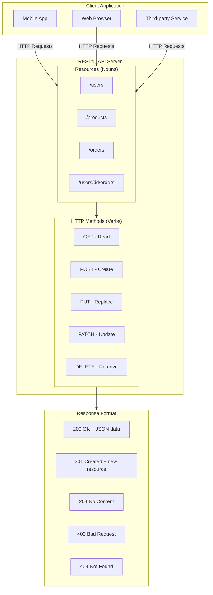
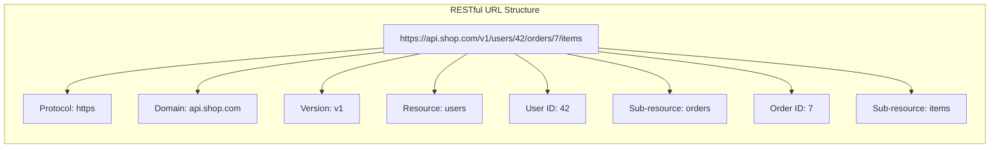

# REST API Design Principles

## 1. Concept & Theory

### Definition

**REST** (Representational State Transfer) is an architectural style for designing networked applications. It defines a set of constraints for how clients and servers should communicate over HTTP.

A **RESTful API** is an API that follows REST principles. It uses standard HTTP methods, treats URLs as resources, and communicates using stateless requests.

REST is not a protocol or standard—it's a set of guidelines. You can break them, but your API becomes harder to use and understand.

### The Problem it Solves

Before REST, APIs were chaotic. Different teams invented different conventions:

```
GET /getUser?id=5
POST /fetchAllProducts
GET /doDeleteOrder/123
POST /api?action=createUser&name=John
```

This creates problems:
- **No consistency**: Every API works differently
- **Hard to learn**: Developers must read docs for every endpoint
- **Poor tooling**: Can't build generic clients or testing tools
- **Confusion**: What does `GET /doDeleteOrder` even mean?

REST solves this by establishing conventions:
- URLs represent **resources** (things), not actions
- HTTP methods represent **operations** on those resources
- Responses use standard status codes
- The API is predictable without reading documentation

With REST:
```
GET    /users/5        → Fetch user 5
GET    /products       → Fetch all products
DELETE /orders/123     → Delete order 123
POST   /users          → Create a user
```

Anyone who knows REST can guess how your API works.

### Real-World Analogy

Think of a **library system**.

The library has **resources**: books, members, loans.

You interact with resources using **standard operations**:
- **GET**: "Show me this book" or "List all members"
- **POST**: "Register a new member"
- **PUT**: "Update this member's address"
- **DELETE**: "Remove this book from the catalog"

You don't say "doGetBookAction" or "executeNewMemberRegistration." You say what resource you want and what you want to do with it.

The librarian (server) doesn't remember your previous requests. Each request is **stateless**—you must provide all needed information every time. If you want to borrow a book, you show your library card (authentication token) with every request.

---

## 2. Visual Architecture (Mermaid)





---

## 3. How It Works (Step-by-Step)

REST is built on **six architectural constraints**. Here's how each works:

### Constraint 1: Client-Server Separation

1. The **client** (browser, mobile app) handles the user interface.
2. The **server** handles data storage and business logic.
3. They communicate only through the API.
4. This separation means you can change the frontend without touching the backend, and vice versa.

### Constraint 2: Statelessness

1. Each request from client to server must contain **all information** needed to understand the request.
2. The server does **not store** any client context between requests.
3. No sessions stored on the server (or if used, treated as a resource).
4. Authentication tokens must be sent with **every request**.
5. This makes servers easy to scale—any server can handle any request.

### Constraint 3: Uniform Interface

This is the core of REST. It has four sub-constraints:

**a) Resource Identification (URLs)**
1. Every resource has a unique **URI** (Uniform Resource Identifier).
2. URLs use **nouns**, not verbs: `/users` not `/getUsers`.
3. Use **plural nouns**: `/products` not `/product`.
4. Nested resources show relationships: `/users/5/orders`.

**b) Resource Manipulation Through Representations**
1. Clients receive a **representation** of the resource (usually JSON).
2. This representation contains enough information to modify or delete the resource.
3. The client sends back modified representations to update resources.

**c) Self-Descriptive Messages**
1. Each message includes enough information to describe how to process it.
2. **Content-Type** header tells the server what format the body is in.
3. **Accept** header tells the server what format the client wants back.

**d) HATEOAS (Hypermedia as the Engine of Application State)**
1. Responses include **links** to related resources.
2. Clients can navigate the API by following links.
3. Example: A user response includes links to their orders, profile, etc.

### Constraint 4: Cacheability

1. Responses must define themselves as **cacheable or non-cacheable**.
2. If cacheable, clients can reuse responses for identical requests.
3. Reduces server load and improves performance.
4. HTTP headers like `Cache-Control`, `ETag`, and `Last-Modified` control caching.

### Constraint 5: Layered System

1. The client cannot tell if it's connected directly to the server or a middleman.
2. **Load balancers**, **proxies**, and **CDNs** can sit between client and server.
3. Each layer only knows about the layer it's directly interacting with.
4. This allows for scalability and security.

### Constraint 6: Code on Demand (Optional)

1. Servers can send executable code to clients (like JavaScript).
2. This is optional and rarely used in APIs.
3. More common in web pages than REST APIs.

---

## 4. Code Implementation (MERN Context)

Let's build a RESTful API for a bookstore.

### Project Structure

```
src/
├── app.js
├── routes/
│   ├── index.js
│   ├── bookRoutes.js
│   └── authorRoutes.js
├── controllers/
│   ├── bookController.js
│   └── authorController.js
├── services/
│   ├── bookService.js
│   └── authorService.js
├── models/
│   └── index.js
└── utils/
    └── responseHandler.js
```

### utils/responseHandler.js
```javascript
// utils/responseHandler.js
// Standardized response format for the entire API.
// Consistency is a key REST principle.

const sendResponse = (res, statusCode, data, message = null) => {
    const response = {
        success: statusCode >= 200 && statusCode < 300,
        ...(message && { message }),
        ...(data !== undefined && { data })
    };

    // Add HATEOAS-style metadata for collections
    if (Array.isArray(data)) {
        response.count = data.length;
    }

    return res.status(statusCode).json(response);
};

const sendError = (res, statusCode, message, errors = null) => {
    const response = {
        success: false,
        message,
        ...(errors && { errors })
    };
    return res.status(statusCode).json(response);
};

module.exports = { sendResponse, sendError };
```

### models/index.js
```javascript
// models/index.js
// In-memory data store for demonstration.
// In production, this would be MongoDB or PostgreSQL.

const books = [
    {
        id: '1',
        title: 'Clean Code',
        authorId: '1',
        isbn: '978-0132350884',
        price: 34.99,
        publishedYear: 2008,
        createdAt: new Date('2024-01-01'),
        updatedAt: new Date('2024-01-01')
    },
    {
        id: '2',
        title: 'The Pragmatic Programmer',
        authorId: '2',
        isbn: '978-0135957059',
        price: 49.99,
        publishedYear: 2019,
        createdAt: new Date('2024-01-02'),
        updatedAt: new Date('2024-01-02')
    }
];

const authors = [
    {
        id: '1',
        name: 'Robert C. Martin',
        country: 'USA',
        createdAt: new Date('2024-01-01')
    },
    {
        id: '2',
        name: 'David Thomas',
        country: 'UK',
        createdAt: new Date('2024-01-01')
    }
];

module.exports = { books, authors };
```

### services/bookService.js
```javascript
// services/bookService.js
// Business logic layer - no HTTP knowledge here.

const { books, authors } = require('../models');

const bookService = {
    // GET /books - with optional filtering and pagination
    findAll: async (query = {}) => {
        let result = [...books];

        // Filtering: GET /books?authorId=1&minPrice=20
        if (query.authorId) {
            result = result.filter(b => b.authorId === query.authorId);
        }
        if (query.minPrice) {
            result = result.filter(b => b.price >= parseFloat(query.minPrice));
        }
        if (query.maxPrice) {
            result = result.filter(b => b.price <= parseFloat(query.maxPrice));
        }

        // Sorting: GET /books?sort=-price (descending) or sort=title (ascending)
        if (query.sort) {
            const sortField = query.sort.startsWith('-')
                ? query.sort.slice(1)
                : query.sort;
            const sortOrder = query.sort.startsWith('-') ? -1 : 1;

            result.sort((a, b) => {
                if (a[sortField] < b[sortField]) return -1 * sortOrder;
                if (a[sortField] > b[sortField]) return 1 * sortOrder;
                return 0;
            });
        }

        // Pagination: GET /books?page=2&limit=10
        const page = parseInt(query.page) || 1;
        const limit = parseInt(query.limit) || 10;
        const startIndex = (page - 1) * limit;
        const endIndex = startIndex + limit;

        const paginatedResult = result.slice(startIndex, endIndex);

        return {
            data: paginatedResult,
            pagination: {
                currentPage: page,
                totalPages: Math.ceil(result.length / limit),
                totalItems: result.length,
                itemsPerPage: limit
            }
        };
    },

    // GET /books/:id
    findById: async (id) => {
        const book = books.find(b => b.id === id);
        if (!book) return null;

        // Include related author data (HATEOAS concept)
        const author = authors.find(a => a.id === book.authorId);

        return {
            ...book,
            author: author ? { id: author.id, name: author.name } : null,
            // HATEOAS: Links to related resources
            _links: {
                self: `/api/v1/books/${book.id}`,
                author: `/api/v1/authors/${book.authorId}`,
                collection: '/api/v1/books'
            }
        };
    },

    // POST /books
    create: async (bookData) => {
        const newBook = {
            id: String(books.length + 1),
            ...bookData,
            createdAt: new Date(),
            updatedAt: new Date()
        };
        books.push(newBook);
        return newBook;
    },

    // PUT /books/:id - Full replacement
    replace: async (id, bookData) => {
        const index = books.findIndex(b => b.id === id);
        if (index === -1) return null;

        // PUT replaces the entire resource
        const replacedBook = {
            id, // Keep the same ID
            title: bookData.title,
            authorId: bookData.authorId,
            isbn: bookData.isbn,
            price: bookData.price,
            publishedYear: bookData.publishedYear,
            createdAt: books[index].createdAt, // Preserve original creation date
            updatedAt: new Date()
        };

        books[index] = replacedBook;
        return replacedBook;
    },

    // PATCH /books/:id - Partial update
    update: async (id, updates) => {
        const index = books.findIndex(b => b.id === id);
        if (index === -1) return null;

        // PATCH only updates provided fields
        books[index] = {
            ...books[index],
            ...updates,
            id, // Prevent ID from being changed
            updatedAt: new Date()
        };

        return books[index];
    },

    // DELETE /books/:id
    delete: async (id) => {
        const index = books.findIndex(b => b.id === id);
        if (index === -1) return false;

        books.splice(index, 1);
        return true;
    }
};

module.exports = bookService;
```

### controllers/bookController.js
```javascript
// controllers/bookController.js
// Handles HTTP layer - parsing requests, sending responses.

const bookService = require('../services/bookService');
const { sendResponse, sendError } = require('../utils/responseHandler');

const bookController = {
    // GET /api/v1/books
    // Supports: ?authorId=1&minPrice=10&maxPrice=50&sort=-price&page=1&limit=10
    getAll: async (req, res, next) => {
        try {
            const result = await bookService.findAll(req.query);

            // Add HATEOAS links for pagination
            const baseUrl = `${req.protocol}://${req.get('host')}${req.baseUrl}`;
            result._links = {
                self: `${baseUrl}?page=${result.pagination.currentPage}`,
                first: `${baseUrl}?page=1`,
                last: `${baseUrl}?page=${result.pagination.totalPages}`
            };

            if (result.pagination.currentPage > 1) {
                result._links.prev = `${baseUrl}?page=${result.pagination.currentPage - 1}`;
            }
            if (result.pagination.currentPage < result.pagination.totalPages) {
                result._links.next = `${baseUrl}?page=${result.pagination.currentPage + 1}`;
            }

            sendResponse(res, 200, result);
        } catch (error) {
            next(error);
        }
    },

    // GET /api/v1/books/:id
    getById: async (req, res, next) => {
        try {
            const book = await bookService.findById(req.params.id);

            if (!book) {
                return sendError(res, 404, `Book with ID ${req.params.id} not found`);
            }

            sendResponse(res, 200, book);
        } catch (error) {
            next(error);
        }
    },

    // POST /api/v1/books
    create: async (req, res, next) => {
        try {
            const { title, authorId, isbn, price, publishedYear } = req.body;

            // Validation - in production, use a library like Joi or Zod
            if (!title || !authorId || !isbn) {
                return sendError(res, 400, 'Validation failed', [
                    ...(!title ? ['title is required'] : []),
                    ...(!authorId ? ['authorId is required'] : []),
                    ...(!isbn ? ['isbn is required'] : [])
                ]);
            }

            const newBook = await bookService.create({
                title,
                authorId,
                isbn,
                price: price || 0,
                publishedYear: publishedYear || new Date().getFullYear()
            });

            // 201 Created - include Location header pointing to new resource
            res.setHeader('Location', `/api/v1/books/${newBook.id}`);
            sendResponse(res, 201, newBook, 'Book created successfully');
        } catch (error) {
            next(error);
        }
    },

    // PUT /api/v1/books/:id - Full replacement
    replace: async (req, res, next) => {
        try {
            const { title, authorId, isbn, price, publishedYear } = req.body;

            // PUT requires ALL fields (it's a full replacement)
            if (!title || !authorId || !isbn || price === undefined || !publishedYear) {
                return sendError(res, 400, 'PUT requires all fields', [
                    'title, authorId, isbn, price, and publishedYear are all required'
                ]);
            }

            const updatedBook = await bookService.replace(req.params.id, {
                title,
                authorId,
                isbn,
                price,
                publishedYear
            });

            if (!updatedBook) {
                return sendError(res, 404, `Book with ID ${req.params.id} not found`);
            }

            sendResponse(res, 200, updatedBook, 'Book replaced successfully');
        } catch (error) {
            next(error);
        }
    },

    // PATCH /api/v1/books/:id - Partial update
    update: async (req, res, next) => {
        try {
            // PATCH only updates provided fields
            const allowedUpdates = ['title', 'authorId', 'isbn', 'price', 'publishedYear'];
            const updates = {};

            for (const field of allowedUpdates) {
                if (req.body[field] !== undefined) {
                    updates[field] = req.body[field];
                }
            }

            if (Object.keys(updates).length === 0) {
                return sendError(res, 400, 'No valid fields to update');
            }

            const updatedBook = await bookService.update(req.params.id, updates);

            if (!updatedBook) {
                return sendError(res, 404, `Book with ID ${req.params.id} not found`);
            }

            sendResponse(res, 200, updatedBook, 'Book updated successfully');
        } catch (error) {
            next(error);
        }
    },

    // DELETE /api/v1/books/:id
    delete: async (req, res, next) => {
        try {
            const deleted = await bookService.delete(req.params.id);

            if (!deleted) {
                return sendError(res, 404, `Book with ID ${req.params.id} not found`);
            }

            // 204 No Content - successful deletion, no body returned
            res.status(204).send();
        } catch (error) {
            next(error);
        }
    }
};

module.exports = bookController;
```

### routes/bookRoutes.js
```javascript
// routes/bookRoutes.js
// RESTful route definitions following resource-based URLs.

const express = require('express');
const router = express.Router();
const bookController = require('../controllers/bookController');

// Collection routes (plural noun)
router.route('/')
    .get(bookController.getAll)      // GET    /books - List all books
    .post(bookController.create);    // POST   /books - Create new book

// Individual resource routes (with ID)
router.route('/:id')
    .get(bookController.getById)     // GET    /books/:id - Get single book
    .put(bookController.replace)     // PUT    /books/:id - Replace entire book
    .patch(bookController.update)    // PATCH  /books/:id - Partial update
    .delete(bookController.delete);  // DELETE /books/:id - Delete book

module.exports = router;
```

### routes/index.js
```javascript
// routes/index.js
// API versioning through URL path.
// This allows multiple API versions to coexist.

const express = require('express');
const router = express.Router();
const bookRoutes = require('./bookRoutes');
const authorRoutes = require('./authorRoutes');

// Version 1 of the API
// All routes prefixed with /api/v1
router.use('/books', bookRoutes);
router.use('/authors', authorRoutes);

// API root - returns available endpoints (discoverability)
router.get('/', (req, res) => {
    res.json({
        message: 'Bookstore API v1',
        endpoints: {
            books: '/api/v1/books',
            authors: '/api/v1/authors'
        },
        documentation: '/api/v1/docs'
    });
});

module.exports = router;
```

### app.js
```javascript
// app.js
// Main Express application with RESTful configuration.

const express = require('express');
const apiRoutes = require('./routes');

const app = express();

// Parse JSON bodies
app.use(express.json());

// Set default Content-Type for responses
app.use((req, res, next) => {
    res.setHeader('Content-Type', 'application/json');
    next();
});

// API versioning: /api/v1/...
app.use('/api/v1', apiRoutes);

// Handle requests to API root
app.get('/api', (req, res) => {
    res.json({
        versions: {
            v1: '/api/v1'
        },
        current: 'v1'
    });
});

// 404 handler for undefined routes
app.use((req, res) => {
    res.status(404).json({
        success: false,
        message: 'Endpoint not found',
        availableEndpoints: {
            api: '/api',
            v1: '/api/v1'
        }
    });
});

// Global error handler
app.use((err, req, res, next) => {
    console.error('Error:', err);
    res.status(err.status || 500).json({
        success: false,
        message: err.message || 'Internal Server Error'
    });
});

module.exports = app;
```

---

## 5. Code Explanation

### Why Use Plural Nouns for Resources?

```
/books     ✓  (collection of books)
/book      ✗  (inconsistent - is it one or many?)

/users/5   ✓  (user with ID 5 from users collection)
/user/5    ✗  (grammatically awkward)
```

Plural nouns are consistent. The collection is `/books`. A single item is `/books/5`. You don't switch between `/book` and `/books`.

### PUT vs PATCH - The Critical Difference

**PUT** = Complete replacement. You must send ALL fields.
```javascript
// PUT /books/1
// You MUST include every field, even unchanged ones
{
    "title": "Clean Code",
    "authorId": "1",
    "isbn": "978-0132350884",
    "price": 39.99,           // Changed from 34.99
    "publishedYear": 2008
}
```

**PATCH** = Partial update. Send only what changed.
```javascript
// PATCH /books/1
// Only the price changes
{
    "price": 39.99
}
```

If you use PUT but only send `{ "price": 39.99 }`, the server should set all other fields to null or default values. This is why PUT requires validation that all fields are present.

### HATEOAS in Practice

HATEOAS means the response includes links to related actions:

```json
{
    "id": "1",
    "title": "Clean Code",
    "authorId": "1",
    "_links": {
        "self": "/api/v1/books/1",
        "author": "/api/v1/authors/1",
        "collection": "/api/v1/books",
        "update": "/api/v1/books/1",
        "delete": "/api/v1/books/1"
    }
}
```

The client doesn't need to hardcode URLs. It follows links from responses. If your API structure changes, clients still work because they follow links dynamically.

Few APIs implement full HATEOAS, but including basic navigation links is good practice.

### Query Parameters for Filtering and Pagination

REST uses query parameters for:
- **Filtering**: `GET /books?authorId=1&minPrice=20`
- **Sorting**: `GET /books?sort=-price` (minus = descending)
- **Pagination**: `GET /books?page=2&limit=10`
- **Field selection**: `GET /books?fields=title,price`

These don't change the resource—they change how you view it. That's why they're query parameters, not path segments.

### The Location Header

When creating a resource with POST, include the `Location` header:

```javascript
res.setHeader('Location', `/api/v1/books/${newBook.id}`);
res.status(201).json(newBook);
```

This tells the client where to find the new resource. Some clients use this to redirect automatically.

---

## 6. Senior Level Insights

### Best Practices

1. **Version Your API from Day One**
   ```
   /api/v1/users
   /api/v2/users
   ```
   You will need to make breaking changes. Versioning lets old clients keep working.

2. **Use Consistent Naming**
   - URLs: lowercase, hyphens for multi-word (`/user-profiles`, not `/userProfiles`)
   - Always plural nouns (`/books`, not `/book`)
   - No verbs in URLs (`/books`, not `/getBooks`)

3. **Return Appropriate Status Codes**
   - 200: Success (GET, PUT, PATCH)
   - 201: Created (POST)
   - 204: No Content (DELETE)
   - 400: Bad Request (validation failed)
   - 401: Unauthorized (not logged in)
   - 403: Forbidden (logged in but not allowed)
   - 404: Not Found
   - 409: Conflict (duplicate resource)
   - 422: Unprocessable Entity (semantic error)
   - 500: Server Error

4. **Support Filtering, Sorting, Pagination**
   - Large collections MUST be paginated
   - Default to sensible limits (e.g., 20 items)
   - Include total count in response

5. **Use Proper HTTP Methods**
   - GET: Never modifies data, must be safe and idempotent
   - POST: Creates new resources, not idempotent
   - PUT: Replaces entire resource, idempotent
   - PATCH: Partial update, may or may not be idempotent
   - DELETE: Removes resource, idempotent

### Common Mistakes

1. **Using Verbs in URLs**
   ```
   POST /createUser     ✗  (verb in URL)
   POST /users          ✓  (method implies creation)

   GET /getAllUsers     ✗  (verb in URL)
   GET /users           ✓  (method implies fetching)
   ```

2. **Incorrect Status Codes**
   ```javascript
   // BAD: Returns 200 for everything
   res.status(200).json({ error: 'User not found' });

   // GOOD: Use proper status code
   res.status(404).json({ message: 'User not found' });
   ```

3. **Not Handling Partial Updates Correctly**
   ```javascript
   // BAD: PUT acts like PATCH
   router.put('/:id', (req, res) => {
       Object.assign(resource, req.body); // Partial update
   });

   // GOOD: PUT requires full replacement
   router.put('/:id', (req, res) => {
       resource = { id, ...req.body }; // Complete replacement
   });
   ```

4. **Inconsistent Response Formats**
   ```javascript
   // BAD: Different structures for different endpoints
   GET /users    → { users: [...] }
   GET /books    → { data: [...], total: 5 }
   GET /orders   → [...]

   // GOOD: Same structure everywhere
   GET /users    → { success: true, data: [...], count: 5 }
   GET /books    → { success: true, data: [...], count: 3 }
   GET /orders   → { success: true, data: [...], count: 8 }
   ```

5. **Ignoring Idempotency**
   - GET, PUT, DELETE should be idempotent (same request = same result)
   - Calling `DELETE /users/5` twice should not error the second time
   ```javascript
   // GOOD: Idempotent DELETE
   if (!user) {
       return res.status(404).json({ message: 'Already deleted or not found' });
       // OR return 204 - "job is done either way"
   }
   ```

### Interview Question

**Q: What is the difference between PUT and PATCH? When would you use each?**

**Ideal Answer:**

"PUT and PATCH are both used for updating resources, but they work differently.

**PUT** is for complete replacement. When you send a PUT request, you're saying 'replace the entire resource with this new version.' You must include all fields in the request body. If you omit a field, it should be set to null or its default value. PUT is idempotent—calling it multiple times with the same data produces the same result.

**PATCH** is for partial updates. You only send the fields you want to change. The server merges these changes with the existing resource. This is useful when a resource has many fields but you only want to update one or two.

**When to use PUT:**
- Replacing an entire resource
- When clients always have the complete resource
- When you want strict validation that all required fields are present
- Simpler semantics—easier to reason about

**When to use PATCH:**
- Updating one or two fields in a large resource
- When bandwidth matters (smaller payloads)
- When multiple clients might update different fields simultaneously

In practice, most APIs use PATCH more often because partial updates are more common. But it's important to implement both correctly—PUT should truly replace, not just merge."

---

## Summary

REST is not about technology—it's about design principles that make APIs predictable, scalable, and easy to use.

**The Core Ideas:**
- Resources are nouns (things), accessed via URLs
- HTTP methods are verbs (actions on things)
- Responses include proper status codes
- Each request is stateless and self-contained
- Responses can include links to related resources (HATEOAS)

**Key Design Rules:**
- Use plural nouns: `/users`, `/books`, `/orders`
- Use HTTP methods correctly: GET reads, POST creates, PUT replaces, PATCH updates, DELETE removes
- Return proper status codes: 200, 201, 204, 400, 404, 500
- Support filtering, sorting, and pagination for collections
- Version your API: `/api/v1/...`
- Be consistent in naming and response format

A well-designed REST API feels intuitive. Developers can guess how endpoints work before reading documentation. That's the goal.
