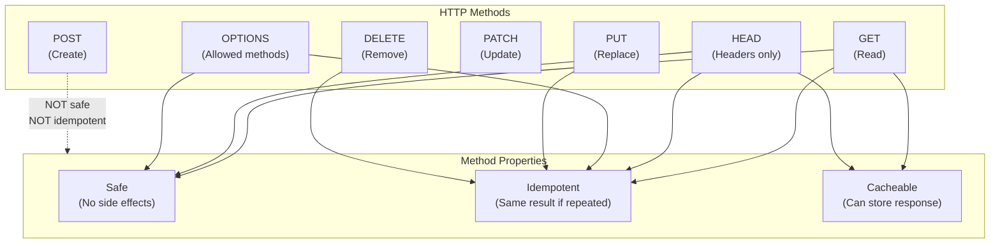
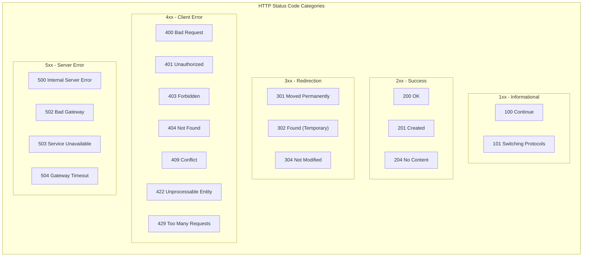

# HTTP Methods & Status Codes

## 1. Concept & Theory

### Definition

**HTTP Methods** (also called HTTP Verbs) define the type of action a client wants to perform on a resource. They are part of the HTTP protocol that powers the web.

**HTTP Status Codes** are three-digit numbers sent by the server in response to a request. They tell the client whether the request succeeded, failed, or requires further action.

Together, methods and status codes form the language of client-server communication. The method says "what I want to do." The status code says "what happened."

### The Problem it Solves

Without standardized methods and status codes, every API would invent its own conventions:

```
// Chaos without standards
POST /api?action=get_user&id=5       // Using POST to read?
GET /deleteUser/5                     // Using GET to delete?
Response: { "status": "error", "code": "E001" }  // Custom error format
```

Problems this creates:
- **No predictability**: Is this endpoint safe to call twice? Will it modify data?
- **No caching**: Browsers don't know which responses can be cached
- **No automation**: Tools can't automatically retry or handle errors
- **Security risks**: GET requests with side effects can be triggered by links or images

HTTP methods and status codes solve this by establishing universal conventions:
- **GET** is always safe (no side effects)
- **POST** creates resources
- **200** means success
- **404** means not found
- **500** means server error

Any developer, any tool, any browser understands these conventions.

### Real-World Analogy

Think of a **post office**.

**HTTP Methods are like mail types**:
- **GET**: "Please send me a copy of this document" (reading)
- **POST**: "Here's a new package to deliver" (creating)
- **PUT**: "Replace the contents of this PO Box entirely" (replacing)
- **PATCH**: "Update just the name on this PO Box" (partial update)
- **DELETE**: "Close this PO Box" (removing)

**Status Codes are like delivery confirmations**:
- **200**: "Delivered successfully"
- **201**: "New PO Box created"
- **400**: "Address is invalid, can't process"
- **404**: "PO Box doesn't exist"
- **500**: "Our sorting machine broke, try again later"

The post office (server) uses standard confirmation slips (status codes) so everyone understands what happened without reading a detailed letter.

---

## 2. Visual Architecture (Mermaid)





---

## 3. How It Works (Step-by-Step)

### HTTP Methods Explained

#### 1. GET - Retrieve Data

1. Client sends a **GET** request to fetch a resource.
2. The request **MUST NOT** have a body (some servers ignore it).
3. Server retrieves the data and returns it.
4. This method is **safe** — it never modifies server data.
5. This method is **idempotent** — calling it 100 times gives the same result.
6. Responses are **cacheable** by browsers and CDNs.

```
GET /api/users/5 HTTP/1.1
Host: example.com
```

#### 2. POST - Create New Resource

1. Client sends a **POST** request with data in the **body**.
2. Server creates a new resource based on the body.
3. Server returns **201 Created** with the new resource.
4. This method is **NOT safe** — it modifies server data.
5. This method is **NOT idempotent** — calling it twice creates two resources.
6. The **Location** header should point to the new resource.

```
POST /api/users HTTP/1.1
Content-Type: application/json

{"name": "Alice", "email": "alice@example.com"}
```

#### 3. PUT - Replace Entire Resource

1. Client sends a **PUT** request with the **complete** new resource.
2. Server **replaces** the entire resource at that URL.
3. If the resource doesn't exist, server may create it (or return 404).
4. This method is **idempotent** — sending the same PUT twice has the same result.
5. You must include **all fields**, not just changed ones.

```
PUT /api/users/5 HTTP/1.1
Content-Type: application/json

{"name": "Alice Smith", "email": "alice@example.com", "role": "admin"}
```

#### 4. PATCH - Partial Update

1. Client sends a **PATCH** request with **only the fields to change**.
2. Server **merges** the changes with the existing resource.
3. This method may or may not be idempotent (depends on implementation).
4. More bandwidth-efficient than PUT for large resources.

```
PATCH /api/users/5 HTTP/1.1
Content-Type: application/json

{"role": "admin"}
```

#### 5. DELETE - Remove Resource

1. Client sends a **DELETE** request to remove a resource.
2. Server deletes the resource and returns **204 No Content** (or 200 with body).
3. This method is **idempotent** — deleting twice should not error.
4. Second delete can return 404 or 204 (both are acceptable).

```
DELETE /api/users/5 HTTP/1.1
```

#### 6. HEAD - Get Headers Only

1. Identical to GET but returns **only headers**, no body.
2. Used to check if a resource exists or get metadata.
3. Useful for checking file size before downloading.

#### 7. OPTIONS - Get Allowed Methods

1. Returns which HTTP methods are allowed for a URL.
2. Used in **CORS preflight** requests by browsers.
3. Response includes `Allow` header listing permitted methods.

---

### Status Code Categories

#### 1xx - Informational (Rare in APIs)

These indicate the request was received and processing continues.

| Code | Name | Meaning |
|------|------|---------|
| 100 | Continue | Server received headers, client should send body |
| 101 | Switching Protocols | Server is switching to WebSocket |

#### 2xx - Success

The request was received, understood, and accepted.

| Code | Name | When to Use |
|------|------|-------------|
| 200 | OK | GET, PUT, PATCH succeeded with response body |
| 201 | Created | POST created a new resource |
| 202 | Accepted | Request accepted for async processing |
| 204 | No Content | DELETE succeeded, no body to return |

#### 3xx - Redirection

The client must take additional action to complete the request.

| Code | Name | When to Use |
|------|------|-------------|
| 301 | Moved Permanently | Resource URL changed forever (SEO) |
| 302 | Found | Temporary redirect |
| 304 | Not Modified | Cached version is still valid |
| 307 | Temporary Redirect | Like 302 but keeps HTTP method |
| 308 | Permanent Redirect | Like 301 but keeps HTTP method |

#### 4xx - Client Error

The client sent a bad request.

| Code | Name | When to Use |
|------|------|-------------|
| 400 | Bad Request | Malformed syntax, invalid JSON |
| 401 | Unauthorized | No authentication provided |
| 403 | Forbidden | Authenticated but not permitted |
| 404 | Not Found | Resource doesn't exist |
| 405 | Method Not Allowed | POST to a GET-only endpoint |
| 409 | Conflict | Duplicate resource, version conflict |
| 410 | Gone | Resource deleted permanently |
| 415 | Unsupported Media Type | Wrong Content-Type header |
| 422 | Unprocessable Entity | Valid JSON but semantic errors |
| 429 | Too Many Requests | Rate limit exceeded |

#### 5xx - Server Error

The server failed to fulfill a valid request.

| Code | Name | When to Use |
|------|------|-------------|
| 500 | Internal Server Error | Unhandled exception, bug |
| 501 | Not Implemented | Method not supported |
| 502 | Bad Gateway | Upstream server returned invalid response |
| 503 | Service Unavailable | Server overloaded or in maintenance |
| 504 | Gateway Timeout | Upstream server didn't respond in time |

---

## 4. Code Implementation (MERN Context)

Let's build an Express API that properly uses HTTP methods and status codes.

### Project Structure

```
src/
├── server.js
├── app.js
├── routes/
│   └── productRoutes.js
├── controllers/
│   └── productController.js
├── services/
│   └── productService.js
├── middleware/
│   └── methodValidator.js
└── utils/
    └── httpStatus.js
```

### utils/httpStatus.js
```javascript
// utils/httpStatus.js
// Centralized HTTP status codes with descriptive names.
// Using constants prevents typos and makes code self-documenting.

const HTTP_STATUS = {
    // 2xx Success
    OK: 200,
    CREATED: 201,
    ACCEPTED: 202,
    NO_CONTENT: 204,

    // 3xx Redirection
    MOVED_PERMANENTLY: 301,
    FOUND: 302,
    NOT_MODIFIED: 304,

    // 4xx Client Errors
    BAD_REQUEST: 400,
    UNAUTHORIZED: 401,
    FORBIDDEN: 403,
    NOT_FOUND: 404,
    METHOD_NOT_ALLOWED: 405,
    CONFLICT: 409,
    GONE: 410,
    UNPROCESSABLE_ENTITY: 422,
    TOO_MANY_REQUESTS: 429,

    // 5xx Server Errors
    INTERNAL_SERVER_ERROR: 500,
    NOT_IMPLEMENTED: 501,
    BAD_GATEWAY: 502,
    SERVICE_UNAVAILABLE: 503,
    GATEWAY_TIMEOUT: 504
};

// Helper to check if status code indicates success
const isSuccess = (statusCode) => statusCode >= 200 && statusCode < 300;

// Helper to check if status code indicates client error
const isClientError = (statusCode) => statusCode >= 400 && statusCode < 500;

// Helper to check if status code indicates server error
const isServerError = (statusCode) => statusCode >= 500 && statusCode < 600;

module.exports = {
    HTTP_STATUS,
    isSuccess,
    isClientError,
    isServerError
};
```

### services/productService.js
```javascript
// services/productService.js
// Business logic layer - handles data operations.

// In-memory database for demonstration
let products = [
    { id: '1', name: 'Laptop', price: 999.99, stock: 50, createdAt: new Date() },
    { id: '2', name: 'Mouse', price: 29.99, stock: 200, createdAt: new Date() }
];

let nextId = 3;

const productService = {
    // Find all products with optional filtering
    findAll: async (filters = {}) => {
        let result = [...products];

        if (filters.minPrice) {
            result = result.filter(p => p.price >= parseFloat(filters.minPrice));
        }
        if (filters.maxPrice) {
            result = result.filter(p => p.price <= parseFloat(filters.maxPrice));
        }
        if (filters.inStock === 'true') {
            result = result.filter(p => p.stock > 0);
        }

        return result;
    },

    // Find single product by ID
    findById: async (id) => {
        return products.find(p => p.id === id) || null;
    },

    // Check if product exists (for HEAD requests)
    exists: async (id) => {
        return products.some(p => p.id === id);
    },

    // Create new product
    create: async (data) => {
        // Check for duplicate name
        const duplicate = products.find(
            p => p.name.toLowerCase() === data.name.toLowerCase()
        );
        if (duplicate) {
            return { error: 'DUPLICATE', existing: duplicate };
        }

        const newProduct = {
            id: String(nextId++),
            name: data.name,
            price: data.price,
            stock: data.stock || 0,
            createdAt: new Date()
        };

        products.push(newProduct);
        return { product: newProduct };
    },

    // Replace entire product (PUT)
    replace: async (id, data) => {
        const index = products.findIndex(p => p.id === id);

        if (index === -1) {
            return null;
        }

        // PUT replaces everything except id and createdAt
        const replacedProduct = {
            id,
            name: data.name,
            price: data.price,
            stock: data.stock,
            createdAt: products[index].createdAt,
            updatedAt: new Date()
        };

        products[index] = replacedProduct;
        return replacedProduct;
    },

    // Partial update (PATCH)
    update: async (id, updates) => {
        const index = products.findIndex(p => p.id === id);

        if (index === -1) {
            return null;
        }

        // PATCH merges updates with existing data
        products[index] = {
            ...products[index],
            ...updates,
            id, // Prevent id from being changed
            updatedAt: new Date()
        };

        return products[index];
    },

    // Delete product
    delete: async (id) => {
        const index = products.findIndex(p => p.id === id);

        if (index === -1) {
            return false;
        }

        products.splice(index, 1);
        return true;
    }
};

module.exports = productService;
```

### controllers/productController.js
```javascript
// controllers/productController.js
// Handles HTTP layer - maps requests to services and responses.

const productService = require('../services/productService');
const { HTTP_STATUS } = require('../utils/httpStatus');

const productController = {
    // GET /products - Retrieve all products
    // Safe, idempotent, cacheable
    getAll: async (req, res, next) => {
        try {
            const products = await productService.findAll(req.query);

            // 200 OK - Standard success response for GET
            res.status(HTTP_STATUS.OK).json({
                success: true,
                count: products.length,
                data: products
            });
        } catch (error) {
            next(error);
        }
    },

    // GET /products/:id - Retrieve single product
    getById: async (req, res, next) => {
        try {
            const product = await productService.findById(req.params.id);

            if (!product) {
                // 404 Not Found - Resource doesn't exist
                return res.status(HTTP_STATUS.NOT_FOUND).json({
                    success: false,
                    message: `Product with ID ${req.params.id} not found`
                });
            }

            // 200 OK - Resource found and returned
            res.status(HTTP_STATUS.OK).json({
                success: true,
                data: product
            });
        } catch (error) {
            next(error);
        }
    },

    // HEAD /products/:id - Check if product exists
    // Returns headers only, no body
    checkExists: async (req, res, next) => {
        try {
            const exists = await productService.exists(req.params.id);

            if (!exists) {
                // 404 - Resource doesn't exist
                return res.status(HTTP_STATUS.NOT_FOUND).end();
            }

            // 200 - Resource exists (no body for HEAD)
            res.status(HTTP_STATUS.OK).end();
        } catch (error) {
            next(error);
        }
    },

    // POST /products - Create new product
    // NOT safe, NOT idempotent
    create: async (req, res, next) => {
        try {
            const { name, price, stock } = req.body;

            // 400 Bad Request - Missing required fields
            if (!name || price === undefined) {
                return res.status(HTTP_STATUS.BAD_REQUEST).json({
                    success: false,
                    message: 'Validation failed',
                    errors: [
                        ...(!name ? ['name is required'] : []),
                        ...(price === undefined ? ['price is required'] : [])
                    ]
                });
            }

            // 422 Unprocessable Entity - Valid JSON but semantic errors
            if (typeof price !== 'number' || price < 0) {
                return res.status(HTTP_STATUS.UNPROCESSABLE_ENTITY).json({
                    success: false,
                    message: 'Invalid data',
                    errors: ['price must be a non-negative number']
                });
            }

            const result = await productService.create({ name, price, stock });

            // 409 Conflict - Duplicate resource
            if (result.error === 'DUPLICATE') {
                return res.status(HTTP_STATUS.CONFLICT).json({
                    success: false,
                    message: `Product with name "${name}" already exists`,
                    existingResource: `/api/products/${result.existing.id}`
                });
            }

            // 201 Created - New resource created
            // Include Location header pointing to new resource
            res.setHeader('Location', `/api/products/${result.product.id}`);
            res.status(HTTP_STATUS.CREATED).json({
                success: true,
                message: 'Product created successfully',
                data: result.product
            });
        } catch (error) {
            next(error);
        }
    },

    // PUT /products/:id - Replace entire product
    // Idempotent - same request = same result
    replace: async (req, res, next) => {
        try {
            const { name, price, stock } = req.body;

            // PUT requires ALL fields
            if (!name || price === undefined || stock === undefined) {
                return res.status(HTTP_STATUS.BAD_REQUEST).json({
                    success: false,
                    message: 'PUT requires all fields',
                    errors: ['name, price, and stock are all required for PUT']
                });
            }

            const product = await productService.replace(req.params.id, {
                name,
                price,
                stock
            });

            if (!product) {
                // 404 Not Found - Can't replace non-existent resource
                return res.status(HTTP_STATUS.NOT_FOUND).json({
                    success: false,
                    message: `Product with ID ${req.params.id} not found`
                });
            }

            // 200 OK - Resource replaced successfully
            res.status(HTTP_STATUS.OK).json({
                success: true,
                message: 'Product replaced successfully',
                data: product
            });
        } catch (error) {
            next(error);
        }
    },

    // PATCH /products/:id - Partial update
    update: async (req, res, next) => {
        try {
            const allowedFields = ['name', 'price', 'stock'];
            const updates = {};

            // Only include fields that are present in request
            for (const field of allowedFields) {
                if (req.body[field] !== undefined) {
                    updates[field] = req.body[field];
                }
            }

            // 400 Bad Request - No valid fields provided
            if (Object.keys(updates).length === 0) {
                return res.status(HTTP_STATUS.BAD_REQUEST).json({
                    success: false,
                    message: 'No valid fields to update',
                    allowedFields
                });
            }

            const product = await productService.update(req.params.id, updates);

            if (!product) {
                // 404 Not Found
                return res.status(HTTP_STATUS.NOT_FOUND).json({
                    success: false,
                    message: `Product with ID ${req.params.id} not found`
                });
            }

            // 200 OK - Resource updated
            res.status(HTTP_STATUS.OK).json({
                success: true,
                message: 'Product updated successfully',
                data: product
            });
        } catch (error) {
            next(error);
        }
    },

    // DELETE /products/:id - Remove product
    // Idempotent - deleting twice should not error (debatable)
    delete: async (req, res, next) => {
        try {
            const deleted = await productService.delete(req.params.id);

            if (!deleted) {
                // Option 1: 404 Not Found (strict)
                // Option 2: 204 No Content (idempotent - job is done either way)
                // We'll use 404 for clarity
                return res.status(HTTP_STATUS.NOT_FOUND).json({
                    success: false,
                    message: `Product with ID ${req.params.id} not found`
                });
            }

            // 204 No Content - Successfully deleted, no body to return
            res.status(HTTP_STATUS.NO_CONTENT).send();
        } catch (error) {
            next(error);
        }
    },

    // OPTIONS /products - Return allowed methods
    // Used for CORS preflight
    options: async (req, res) => {
        res.setHeader('Allow', 'GET, POST, OPTIONS');
        res.setHeader('Access-Control-Allow-Methods', 'GET, POST, OPTIONS');
        res.status(HTTP_STATUS.OK).end();
    },

    // OPTIONS /products/:id - Return allowed methods for single resource
    optionsById: async (req, res) => {
        // Check if resource exists to determine allowed methods
        const exists = await productService.exists(req.params.id);

        if (exists) {
            res.setHeader('Allow', 'GET, HEAD, PUT, PATCH, DELETE, OPTIONS');
        } else {
            res.setHeader('Allow', 'GET, HEAD, PUT, OPTIONS');
        }

        res.status(HTTP_STATUS.OK).end();
    }
};

module.exports = productController;
```

### middleware/methodValidator.js
```javascript
// middleware/methodValidator.js
// Validates that the HTTP method is allowed for the route.

const { HTTP_STATUS } = require('../utils/httpStatus');

// Factory function to create middleware for allowed methods
const allowMethods = (...methods) => {
    return (req, res, next) => {
        // OPTIONS is always allowed (for CORS)
        if (req.method === 'OPTIONS') {
            res.setHeader('Allow', methods.join(', '));
            return res.status(HTTP_STATUS.OK).end();
        }

        // Check if method is allowed
        if (!methods.includes(req.method)) {
            res.setHeader('Allow', methods.join(', '));
            return res.status(HTTP_STATUS.METHOD_NOT_ALLOWED).json({
                success: false,
                message: `Method ${req.method} not allowed`,
                allowedMethods: methods
            });
        }

        next();
    };
};

module.exports = { allowMethods };
```

### routes/productRoutes.js
```javascript
// routes/productRoutes.js
// RESTful routes with proper HTTP methods.

const express = require('express');
const router = express.Router();
const productController = require('../controllers/productController');

// Collection routes: /products
router.get('/', productController.getAll);          // GET     - List all products
router.post('/', productController.create);         // POST    - Create new product
router.options('/', productController.options);     // OPTIONS - CORS preflight

// Single resource routes: /products/:id
router.get('/:id', productController.getById);          // GET     - Retrieve product
router.head('/:id', productController.checkExists);     // HEAD    - Check existence
router.put('/:id', productController.replace);          // PUT     - Replace product
router.patch('/:id', productController.update);         // PATCH   - Update product
router.delete('/:id', productController.delete);        // DELETE  - Remove product
router.options('/:id', productController.optionsById);  // OPTIONS - CORS preflight

module.exports = router;
```

### app.js
```javascript
// app.js
// Express application with proper HTTP status code handling.

const express = require('express');
const productRoutes = require('./routes/productRoutes');
const { HTTP_STATUS } = require('./utils/httpStatus');

const app = express();

// Parse JSON request bodies
app.use(express.json());

// Log all requests with method and path
app.use((req, res, next) => {
    console.log(`${req.method} ${req.path}`);
    next();
});

// API routes
app.use('/api/products', productRoutes);

// 404 handler - Route not found
app.use((req, res) => {
    res.status(HTTP_STATUS.NOT_FOUND).json({
        success: false,
        message: 'Endpoint not found',
        path: req.path,
        method: req.method
    });
});

// Global error handler
app.use((err, req, res, next) => {
    console.error('Error:', err);

    // Determine appropriate status code
    let statusCode = err.status || HTTP_STATUS.INTERNAL_SERVER_ERROR;

    // Handle specific error types
    if (err.name === 'SyntaxError' && err.type === 'entity.parse.failed') {
        // JSON parse error
        statusCode = HTTP_STATUS.BAD_REQUEST;
        return res.status(statusCode).json({
            success: false,
            message: 'Invalid JSON in request body'
        });
    }

    res.status(statusCode).json({
        success: false,
        message: err.message || 'Internal Server Error'
    });
});

module.exports = app;
```

### server.js
```javascript
// server.js
// Entry point for the Express application.

const app = require('./app');

const PORT = process.env.PORT || 3000;

app.listen(PORT, () => {
    console.log(`Server running on port ${PORT}`);
    console.log(`API: http://localhost:${PORT}/api/products`);
});
```

---

## 5. Code Explanation

### Why Use an HTTP_STATUS Object?

Magic numbers in code are hard to understand:

```javascript
// BAD: What does 409 mean?
res.status(409).json({ error: 'Duplicate' });

// GOOD: Self-documenting
res.status(HTTP_STATUS.CONFLICT).json({ error: 'Duplicate' });
```

Using constants:
- Prevents typos (IDE will catch `HTTP_STATUS.CONFLIT`)
- Makes code self-documenting
- Centralizes status codes in one place

### 400 vs 422 - When to Use Which?

**400 Bad Request**: The request is malformed. The server cannot parse it.
- Invalid JSON syntax: `{ name: "broken }`
- Missing required fields
- Wrong data types in the request

**422 Unprocessable Entity**: The request is valid, but semantically incorrect.
- Valid JSON, but price is negative
- Valid JSON, but date is in the past
- Valid JSON, but business rules are violated

```javascript
// 400 - Can't even parse this
{ name: }  // Syntax error

// 422 - Valid JSON, but makes no sense
{ "name": "TV", "price": -500 }  // Negative price
```

### 401 vs 403 - Authentication vs Authorization

**401 Unauthorized** (misleading name, should be "Unauthenticated"):
- The client is NOT logged in
- No credentials provided, or credentials are invalid
- Response should include `WWW-Authenticate` header
- Client should: Log in and retry

**403 Forbidden**:
- The client IS logged in
- But they don't have permission for this action
- Client should: Request access or give up

```javascript
// No token provided
GET /admin/users → 401 Unauthorized

// Token provided, but user is not admin
GET /admin/users → 403 Forbidden
```

### Why HEAD Method Exists

HEAD is identical to GET but returns no body. Use cases:

1. **Check if resource exists**: Before downloading a large file
2. **Get metadata**: File size, last modified date
3. **Verify links**: Check if URL is still valid
4. **Cache validation**: Check `ETag` or `Last-Modified`

```javascript
// Check if file exists before downloading
HEAD /files/large-report.pdf

// Response: 200 OK
// Content-Length: 52428800 (50 MB)
// Now client can decide if they want to download
```

### Idempotency Explained

**Idempotent** means: calling the operation multiple times has the same effect as calling it once.

| Method | Idempotent? | Why? |
|--------|-------------|------|
| GET | Yes | Just reading, no changes |
| HEAD | Yes | Just reading, no changes |
| PUT | Yes | Same replacement = same result |
| DELETE | Yes | Already deleted = still deleted |
| POST | **No** | Each call creates a new resource |
| PATCH | Maybe | Depends on implementation |

Why idempotency matters:
- **Network failures**: If response is lost, client can safely retry
- **Load balancers**: Can retry requests on server failure
- **User behavior**: Double-clicking a button won't cause problems

```javascript
// Safe to retry PUT
PUT /users/5 { "name": "Alice" }
// First call: Changes name to Alice
// Second call: Name is already Alice, no change

// NOT safe to retry POST
POST /orders { "item": "Laptop" }
// First call: Creates order #1
// Second call: Creates order #2 (duplicate!)
```

---

## 6. Senior Level Insights

### Best Practices

1. **Use Specific Status Codes**
   ```javascript
   // BAD: Everything is 200 or 500
   res.status(200).json({ error: 'Not found' });

   // GOOD: Appropriate codes
   res.status(404).json({ message: 'Not found' });
   ```

2. **Include Helpful Error Bodies**
   ```javascript
   // BAD: Just a code
   res.status(400).end();

   // GOOD: Explain what went wrong
   res.status(400).json({
       success: false,
       message: 'Validation failed',
       errors: [
           { field: 'email', message: 'Invalid email format' },
           { field: 'age', message: 'Must be at least 18' }
       ]
   });
   ```

3. **Use Location Header for 201**
   ```javascript
   res.setHeader('Location', `/api/users/${newUser.id}`);
   res.status(201).json(newUser);
   ```

4. **Return 204 for Successful DELETE**
   ```javascript
   // Don't return the deleted object
   res.status(204).send();
   ```

5. **Handle Method Not Allowed (405)**
   ```javascript
   // If someone POSTs to a GET-only endpoint
   res.setHeader('Allow', 'GET, HEAD');
   res.status(405).json({ error: 'Method not allowed' });
   ```

### Common Mistakes

1. **Using GET for Actions with Side Effects**
   ```javascript
   // BAD: GET should not modify data
   app.get('/api/users/:id/delete', (req, res) => {
       userService.delete(req.params.id);
       res.json({ deleted: true });
   });
   // Problem: Browsers prefetch links, bots follow links,
   // someone could delete data just by clicking a link!

   // GOOD: Use DELETE method
   app.delete('/api/users/:id', (req, res) => {
       userService.delete(req.params.id);
       res.status(204).send();
   });
   ```

2. **Always Returning 200**
   ```javascript
   // BAD: 200 for everything
   res.status(200).json({
       success: false,
       error: 'User not found'
   });
   // Problem: HTTP clients, caches, monitoring tools
   // all think this is a success

   // GOOD: Proper status code
   res.status(404).json({
       success: false,
       message: 'User not found'
   });
   ```

3. **Confusing 401 and 403**
   ```javascript
   // BAD: Using 403 when not logged in
   if (!req.user) {
       return res.status(403).json({ error: 'Forbidden' });
   }

   // GOOD: 401 for missing auth, 403 for insufficient permissions
   if (!req.user) {
       return res.status(401).json({ error: 'Authentication required' });
   }
   if (!req.user.isAdmin) {
       return res.status(403).json({ error: 'Admin access required' });
   }
   ```

4. **Using POST for Everything**
   ```javascript
   // BAD: POST for reading data
   app.post('/api/getUser', (req, res) => { ... });
   app.post('/api/deleteUser', (req, res) => { ... });

   // GOOD: Proper methods
   app.get('/api/users/:id', (req, res) => { ... });
   app.delete('/api/users/:id', (req, res) => { ... });
   ```

5. **Not Returning Body with Error Codes**
   ```javascript
   // BAD: Client has no idea what went wrong
   res.status(400).end();

   // GOOD: Explain the error
   res.status(400).json({
       message: 'Invalid request',
       errors: ['email is required', 'password must be 8+ characters']
   });
   ```

### Interview Question

**Q: What is the difference between 401 and 403 status codes? When would you use each?**

**Ideal Answer:**

"401 and 403 are both authentication/authorization errors, but they mean different things.

**401 Unauthorized** (which really means 'Unauthenticated'):
- The client has not provided valid credentials
- Either no credentials were sent, or the credentials were invalid
- The server is saying: 'I don't know who you are'
- The client should: Log in and retry with valid credentials
- The response should include a `WWW-Authenticate` header

**403 Forbidden**:
- The client IS authenticated (the server knows who they are)
- But they don't have permission to access this resource
- The server is saying: 'I know who you are, but you're not allowed'
- Re-authenticating won't help—the user needs different permissions

**Examples:**

```
# No token sent
GET /admin → 401 (Who are you?)

# Valid token, but user is not admin
GET /admin → 403 (You're John, but John isn't an admin)

# Invalid/expired token
GET /admin → 401 (This token is garbage, who are you?)
```

**In code:**
```javascript
// No auth header at all, or invalid token
if (!isAuthenticated(req)) {
    return res.status(401).json({ message: 'Please log in' });
}

// Valid token, but wrong permissions
if (!hasPermission(req.user, 'admin')) {
    return res.status(403).json({ message: 'Admin access required' });
}
```

The key insight is: 401 is about identity (who are you?), 403 is about permission (are you allowed?)."

---

## Summary

HTTP methods and status codes are the vocabulary of web communication. They provide a universal language that clients, servers, browsers, and tools all understand.

**Key HTTP Methods:**
| Method | Purpose | Safe? | Idempotent? |
|--------|---------|-------|-------------|
| GET | Read | Yes | Yes |
| POST | Create | No | No |
| PUT | Replace | No | Yes |
| PATCH | Update | No | Maybe |
| DELETE | Remove | No | Yes |
| HEAD | Metadata | Yes | Yes |
| OPTIONS | Capabilities | Yes | Yes |

**Key Status Codes:**
| Range | Category | Examples |
|-------|----------|----------|
| 2xx | Success | 200 OK, 201 Created, 204 No Content |
| 4xx | Client Error | 400 Bad Request, 401 Unauthorized, 403 Forbidden, 404 Not Found |
| 5xx | Server Error | 500 Internal Error, 503 Unavailable |

**Golden Rules:**
1. GET must never modify data
2. POST creates new resources (not idempotent)
3. PUT replaces entire resources (idempotent)
4. Use specific status codes, not just 200/500
5. 401 = not logged in, 403 = not permitted
6. Always include helpful error messages in response body
